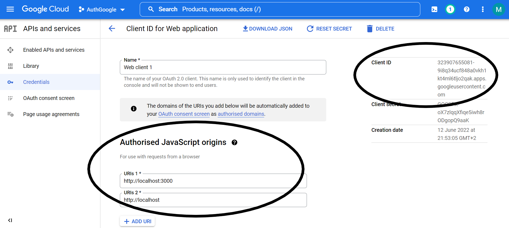
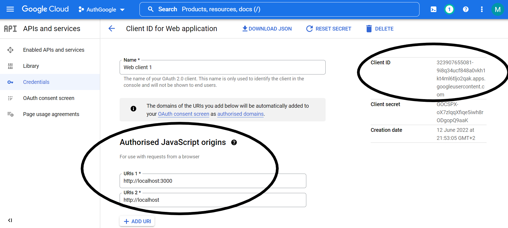

Google Credentials
==================

Google APIs allow communication with Google Services and their
integration to other services.

In order to use the Google APIs, you must go to
GoogleCloud/APIs and services/Credentials and create OAuth client
ID.

[https://console.cloud.google.com/apis/credentials](https://console.cloud.google.com/apis/credentials)

After creating the OAuth client ID credentials, we must register our
website by adding the route on which Google login will be performed
(Authorized JavaScript origins)

The most important thing is the Client ID, which is unique to our
credentials, and we add it on the Front end in order to be able to use
Google login, on backend we use client id to check is the google token
generated with our client id because it is unique to our
application.

