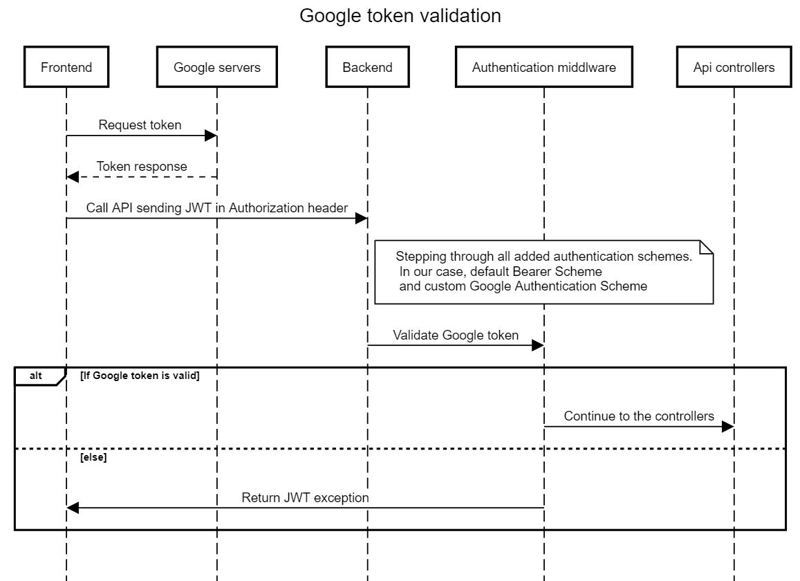

Google token validation
=======================

In order to validate the token on the server side, we need to create a
custom authentication scheme.We must also install the
Google.Apis.Auth package from which we take the validate async method
and with which we validate the token.Because this is a
custom authentication scheme, we have to manually create the claims
principal.

### *Claims Principal*

Claims Principal is an object populated from the access token claims
after the JWT has been verified.

*Example of Google Authentication Scheme*
-----------------------------------------

```csharp
    public class GoogleAuthenticationScheme : ISecurityTokenValidator
    {
        private readonly string clientId;
        private readonly JwtSecurityTokenHandler tokenHandler;

        public GoogleAuthenticationScheme(string clientId)
        {
            this.clientId = clientId;
            this.tokenHandler = new JwtSecurityTokenHandler();
        }

        public bool CanValidateToken => true;

        public int MaximumTokenSizeInBytes { get; set; } = TokenValidationParameters.DefaultMaximumTokenSizeInBytes;

        public bool CanReadToken(string securityToken)
        {
            return tokenHandler.CanReadToken(securityToken);
        }

        public ClaimsPrincipal ValidateToken(string securityToken, TokenValidationParameters validationParameters, out SecurityToken validatedToken)
        {
            validatedToken = tokenHandler.ReadJwtToken(securityToken);
            var principle = new ClaimsPrincipal();

            GoogleJsonWebSignature.Payload payload
                = GoogleJsonWebSignature
                    .ValidateAsync(securityToken, new GoogleJsonWebSignature.ValidationSettings()
                    {
                        Audience = new[] { clientId }
                    }).Result;

            var claims = new List<Claim>
                    {
                        new Claim(ClaimTypes.Name, payload.GivenName),
                        new Claim(ClaimTypes.Surname, payload.FamilyName),
                        new Claim(ClaimTypes.Email, payload.Email),
                    };

            principle.AddIdentity(new ClaimsIdentity(claims, JwtBearerDefaults.AuthenticationScheme));
            return principle;
        }
    }
```

After validating the token, we check if the user already exists in our
database and add it if it doesn't exist.

```csharp
    public class GoogleAuthService : AppBaseService
    {
        private readonly IHttpContextAccessor httpContextAccessor;
        private readonly UserService userService;

        public GoogleAuthService(
            IUnitOfWorkFactory factory,
            ILocalizationService localizationService,
            IHttpContextAccessor httpContextAccessor,
            IUserContextReader userContextReader,
            UserService userService)
            : base(factory.CreateAppUnitOfWork(), userContextReader, localizationService)
        {
            this.httpContextAccessor = httpContextAccessor;
            this.userService = userService;
        }

        public async Task GoogleLogin()
        {
            ClaimsPrincipal claimsPrincipal = this.httpContextAccessor.HttpContext.User;

            Claim? firstName = claimsPrincipal.FindFirst(ClaimTypes.Name);

            Claim? lastname = claimsPrincipal.FindFirst(ClaimTypes.Surname);

            Claim? email = claimsPrincipal.FindFirst(ClaimTypes.Email);

            if (firstName == null || lastname == null || email == null)
            {
                throw new GoogleTokenParameterException(LocalizationService);
            }

            UserEntity? user = await this.AppUnitOfWork.UserRepository.GetByEmail(email.Value);

            if (user == null)
            {
                UserEntity newUserEntity = new()
                {
                    FirstName = firstName.Value,
                    LastName = lastname.Value,
                    Email = email.Value,
                    Password = "",
                    UserRoleId = Guid.Parse(UserRoles.BasicUser)
                };

                await userService.AnonymouslyAddUser(newUserEntity);
            }
        }
    }
```

*Google token validation sequence diagram*
------------------------------------------

[Google token validation
diagram](https://sequencediagram.org/index.html?presentationMode=readOnly#initialData=C4S2BsFMAIHEHt4HMrWPA1pAdtAbgIbggAmBo82AUFQA4EBOoAxiPdsNAGIOXA4k6jFmwIc4iFDADOkBnjnShTEK3acAQgWZZsg+irVjOAQQCuwABY4W5EJWgBbUiXAB3RpGUj10E7RBoZj5ecCgGJSoePgEAWgA+BGRUWXlFAC4AJUgARzNIaU50XWgo3g4BAB5Y2KSpaFSFCPSAFUwcaAYC2kpZMpi9BK0dAXSAYSJwPwAFAEkGgRBsJGgAKQB1FuglvwtLeAYQAC87B2sCEjkqbHh+aHgm3asbVVPcZxJXDy70gGV+WgBZZoSy8MxISzQSZQz6QEhQvYvZhvBrMayOAoAOgAOrhZrh4GYGEECLIADTQS4AMwIZnAmkgnmJvzRkAxuKheiCZkK8EcEmSMHMzw4rwouBZ6K8VGGuhICWF1lFyPFThc7k86QAakRSOQYHVUMUcDQiJxZlSBfVjbgQNJ8LrBIqkSiPl9PAqAkEQvAwhkxnwlvk0PAQTBghxQuElJBwLJoLG+s7la71d9IAlohU9FlIMAibgNltIAAPZiQWjiqgCKhAA)


