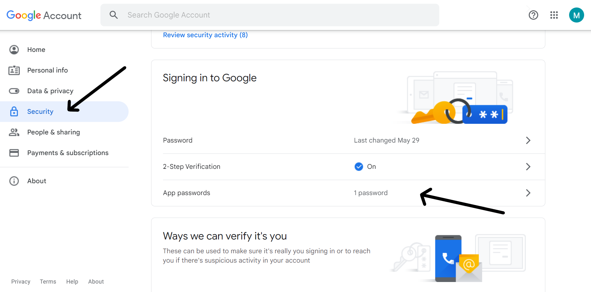
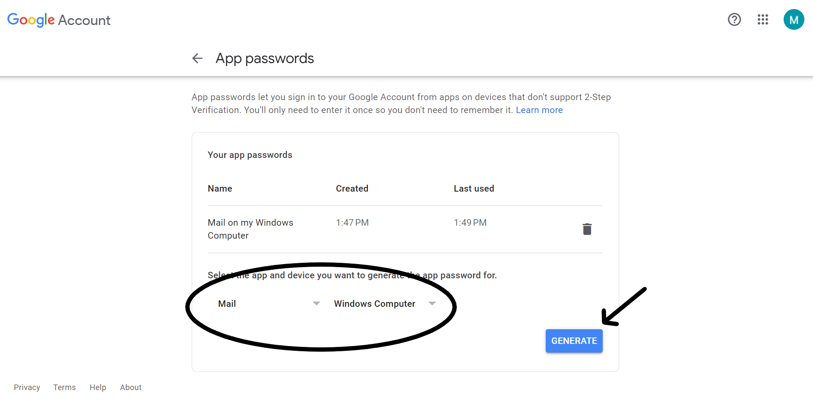
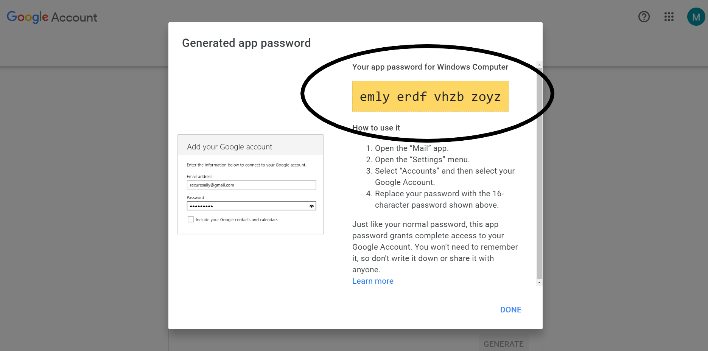

Smtp Configuration
==================

```csharp
    "SmtpOptions": 
        {
            "Host": "smtp.gmail.com",
            "Username": "sipodsoftware@gmail.com",
            "Password": "whxqzsnljgnwfoqo",
            "Port": 587
        }
```

Host - represents the email service from which emails will be sent.

Username - represents a specific mail.

Password - represents a specific App password for given email.
<br><br>
The following steps will explain how to create an app password for gmail:<br>
First you have to go to options then security then turn on 2 step verification and click on App password.
<br>


After that you have to select mail and windows computer and click generate.



And finally you get your app password for Windows.


